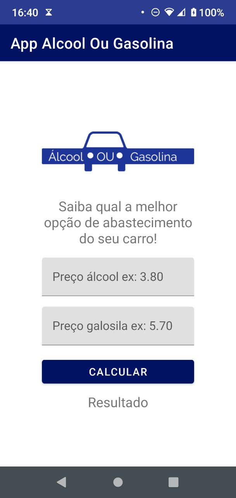
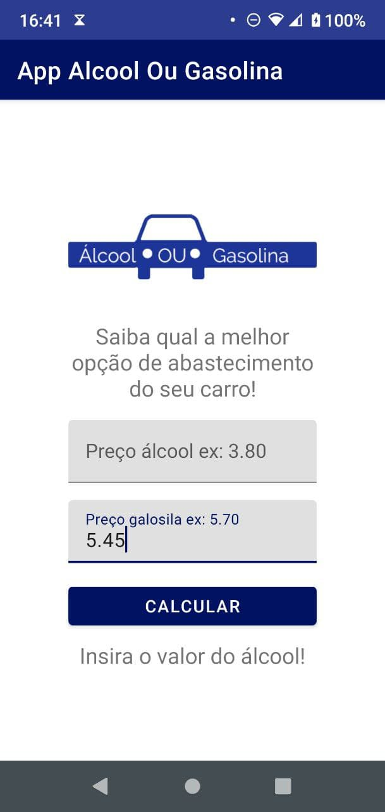
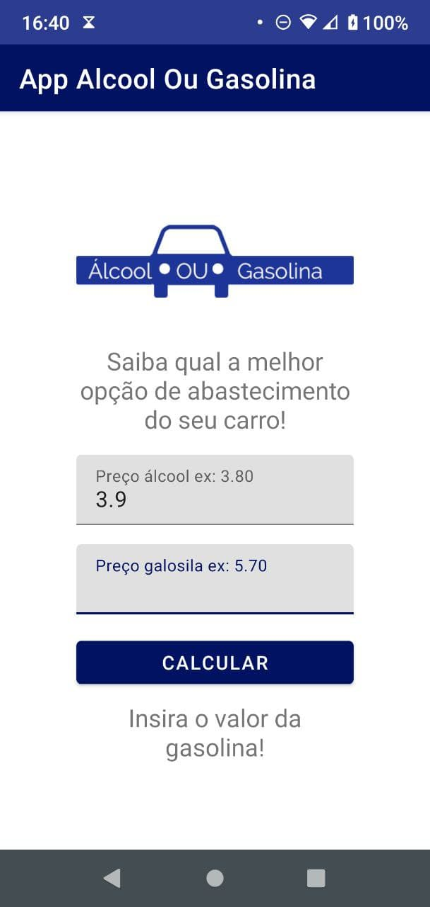
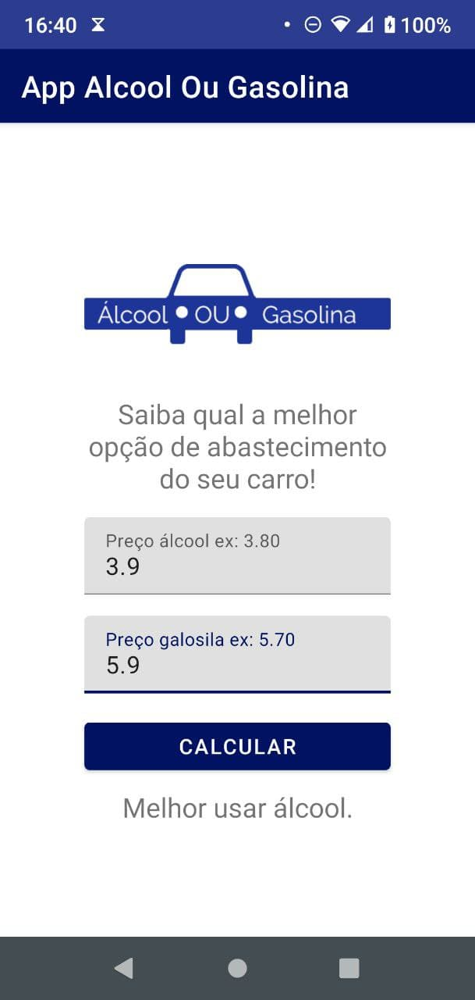
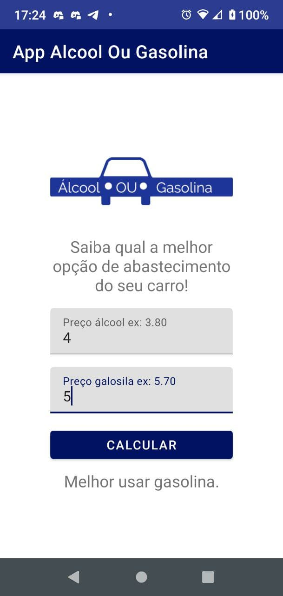

# App Álcool ou Gasolina

## Table of contents

- [Introduction](#introduction)
- [Description](#Description)
- [Screenshots](#screenshots)
- [Technical info](#technical-info)

  [Languages](#languages)

- [Credits](#credits)
- [License](#license)

## Introduction

This app can help you choose between gasoline or ethanol if you have a flex-fuel vehicle and you want to save some money.

## Description

The user should insert the price for the alcohol and for the gasoline and then press the button "Calcular". If for some reason the user don't input one of the values, the app will warn they to input the value that wasn't inserted.

## Screenshots

|                 "Insert the alcohol price" warning                 |                 "Insert the gasoline price" warning                  |
| :----------------------------------------------------------------: | :------------------------------------------------------------------: |
|  |  |

|                     "Choose alcohol"                     |                     "Choose gasoline"                      |
| :------------------------------------------------------: | :--------------------------------------------------------: |
|  |  |

## Technical info

### Languages

 

# Credits

This app is one of the projects developed in the online course **Desenvolvimento Android Completo 2021 - Crie 18 Apps**, available at [Udemy](https://www.udemy.com/course/curso-de-desenvolvimento-android-oreo/).

## License

